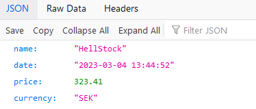

# MegaPlayground

The concept of this repository is to try and show a system that has multiple components to it.
This one utilizes presence of an existing Database, several back-end services that communicate with each other and a front-end service.  Together with it, everything is running on Docker containers, where in parallel there are also monitoring systems used for tracking the activity of certain operations.
The idea is that you could expand and add to the system new components and see how they could interact.
Everything operates on microservices level, meaning it should be possible to swap and change components at will.
All of the components used in this case are meant only for educational purposes to allow for improving of own skills working with programming and modern technologies. This applies to usage of docker container versions, conceptual examples and the setup.

Feel free to add more services, change existing ones or expand the system further with concepts like deploying everything with K8S or making builds with something like Jenkins where first the unit tests are ran for checking the state of the system. There is quite a bit of room also for more efficient code to be present (i.e. refactoring).

What is the essence of the existing services? It's just an idea of a stock market. There is a Market Service that lives it's own life and generates stock prices from time to time. They are saved in a Database. A Stocks API can retrieve that information from the databases (without communicating with the market directly). A front-end application is made for the user to be able to interact with the Stocks API without the need to access paths or know any of the url-s to be aware on the situation in the market.

## Services Diagram

## How to run the infrastructure (currently for Windows)

1. Install Docker on your computer (I have been using Docker version 20.10.21).
2. Download the repository on your computer.
3. Open Powershell.
4. Navigate to the directory where you have saved the repository locally.
5. Navigate to the builds -> Scripts folder. E.g. `cd .\builds\Scripts\`
6. Run `powershell -ExecutionPolicy Bypass`. This is to insure the scripts could be run from your system.
7. Run `prepare-infrastructure-stocks.ps1` script. It should prepare the whole infrastructure for you. E.g. `.\prepare-infrastructure-stocks.ps1`

**NOTE:**
For each subsequent re-run if you will be changing something or adding, you can also run `prepare-infrastructure-stocks.ps1` with additional flags. 

* -keepDotNet: Allows you to keep your current containers for .NET application as they are. This is convenient for when you are recreating the infrastructure without touching the .NET side prior, meaning there is no reason for re-building it from scratch.

* -keepJS: Allows you to keep your current containers for JavaScript based front-end application as they are. This is convenient for when you are recreating the infrastructure without touching the front-endT side prior, meaning there is no reason for re-building it from scratch.

All operations for keeping, recreating, deleting & stopping the infrastructure are done through the several existing scripts in the \builds\Scripts path. If you want to change the performance of your application, first of all, please refer to them.

**IMPORTANT NOTE:** The containers are deleted every time the infrastructure is re-created (unless flags are used). But together with that pruning also happens of dangling and unused images. Therefore, if you are running these scripts and have other projects on your computer, make sure to evaluate the options carefully for your use case and change the performance of the `components-cleaner-stocks.ps1` script to not cause any harm to any of your other projects.

## TODOs
- [X] Make a readme description on how to run the project.
- [X] Add a basic graph showing how components work together.
- [X] Expand the graph of services when all relevant TODOs are finished.
- [X] Add Vue pages service, that will communicate with the StocksAPI.
- [X] Add Vue front-end to a docker container.
- [X] Add Redis on top to cache search results as stock prices only update once x minutes.
- [X] Prepare everything (relevant parts) with the git setup.

## URLs

In order to see the project you will want to access a number of URLs.

### Docker
You can find most of the practical use URLs through the Docker Desktop application (they might change or new get added as the project grows).

### Front-End

`http://localhost:6060/`

### Hangfire (Market API)
You can control the way the Market works with change of the stock prices and monitor when a scheduled process for an update to the stock price comes in (though preferably this should be done through .NET code).

`http://localhost:8002/hangfire`

**NOTE** Consider that Monitoring Metrics could be added here as well, if an implementation concept is found. Then this could utilize presence of the Prometheus service much more efficiently.

### Stocks API
Here you can view the stock prices that are retrieved via an API.

`http://localhost:8000/`

Relevant endpoints:
List of all stocks (ids are generated a new each time, this is needed for the Front-End application)

`/StocksList`

Name of the stock:

`/XYZStock`

`/HellStock`

`/EvilCorpStock`

Metrics from Prometheus for the application

`http://localhost:8001/metrics`

### Database (Postgres)

Please see the default username and password used to connect in the `docker-compose-stocks.yml` file, but by default it should be `admin@admin.com`, `admin`. The password to connect to the Stocks db should be `root`. NOTE: These simplistic credentials are used only in this demo.

`http://localhost:5050`

### Grafana

Please see the default username and password used to connect in the `docker-compose-stocks.yml` file. Though the default credentials should be `admin`, `admin`.

`http://localhost:3001`

(Example of a use case)

### Redis

Redis is running as a caching layer for the StocksAPI service. You can tweak few variables in settings for it (and potentially on the .NET side, depending on the amount of changes done) to change the performance of it to your desired solution.